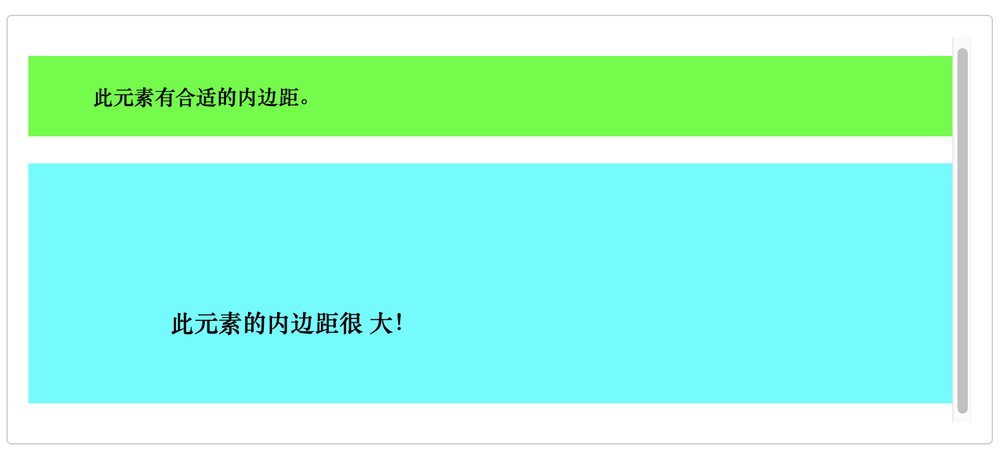

# WTF CSS 极简教程: 4. 盒模型

WTF CSS 教程，总结/搬运自[MDN CSS 教程](https://developer.mozilla.org/zh-CN/docs/Web/CSS)，帮助新人快速入门 CSS。

**推特**：[@WTFAcademy_](https://twitter.com/WTFAcademy_) ｜ [@0xAA_Science](https://twitter.com/0xAA_Science)

**WTF Academy 社群：** [官网 wtf.academy](https://wtf.academy) | [WTF Solidity 教程](https://github.com/AmazingAng/WTFSolidity) | [discord](https://discord.wtf.academy) | [微信群申请](https://docs.google.com/forms/d/e/1FAIpQLSe4KGT8Sh6sJ7hedQRuIYirOoZK_85miz3dw7vA1-YjodgJ-A/viewform?usp=sf_link)

所有代码和教程开源在 github: [github.com/WTFAcademy/WTF-CSS](https://github.com/WTFAcademy/WTF-CSS)

---

这一讲，我们来介绍 CSS 盒模型。在 CSS 中，所有的元素都被一个个的“盒子（box）”包围着，理解这些“盒子”的基本原理，是我们使用 CSS 实现准确布局、处理元素排列的关键。

## 什么是 CSS 盒模型？

完整的 CSS 盒模型应用于块级盒子，内联盒子只使用盒模型中定义的部分内容。模型定义了盒的每个部分 —— margin, border, padding, and content —— 合在一起就可以创建我们在页面上看到的内容。为了增加一些额外的复杂性，有一个标准的和替代（IE）的盒模型。

### 盒模型的各个部分

CSS 中组成一个块级盒子需要：

- Content box: 这个区域是用来显示内容，大小可以通过设置 width 和 height.
- Padding box: 包围在内容区域外部的空白区域；大小通过 padding 相关属性设置。
- Border box: 边框盒包裹内容和内边距。大小通过 border 相关属性设置。
- Margin box: 这是最外面的区域，是盒子和其他元素之间的空白区域。大小通过 margin 相关属性设置。

如下图：


## 标准盒模型

在标准模型中，如果你给盒设置 width 和 height，实际设置的是 content box。padding 和 border 再加上设置的宽高一起决定整个盒子的大小。见下图。

假设定义了 width, height, margin, border, and padding:

```css
.box {
  width: 350px;
  height: 150px;
  margin: 25px;
  padding: 25px;
  border: 5px solid black;
}
```

如果使用标准模型宽度 = 410px (350 + 25 + 25 + 5 + 5)，高度 = 210px (150 + 25 + 25 + 5 + 5)，padding 加 border 再加 content box。


> 备注：
>
> margin 不计入实际大小 —— 当然，它会影响盒子在页面所占空间，但是影响的是盒子外部空间。盒子的范围到边框为止 —— 不会延伸到 margin。

## 替代（IE）盒模型

你可能会认为盒子的大小还要加上边框和内边距，这样很麻烦，而且你的想法是对的 ! 因为这个原因，css 还有一个替代盒模型。使用这个模型，所有宽度都是可见宽度，所以内容宽度是该宽度减去边框和填充部分。使用上面相同的样式得到 (width = 350px, height = 150px)。如下图：


也就是说在替代（IE）盒模型下，你设置 `width` 属性，已经不仅仅是 `content` 的宽度，还包含了 `padding` 和 `border` 的大小。

## 改变盒模型

默认浏览器会使用标准模型。如果需要使用替代模型，您可以通过为其设置 box-sizing: border-box 来实现。这样就可以告诉浏览器使用 border-box 来定义区域，从而设定您想要的大小。

```css
.box {
  box-sizing: border-box;
}
```

如果你希望所有元素都使用替代模式，而且确实很常用，设置 box-sizing 在 <html> 元素上，然后设置所有元素继承该属性，正如下面的例子。

```css
html {
  box-sizing: border-box;
}

/* 使所有元素继承该属性 */
*,
*::before,
*::after {
  box-sizing: inherit;
}
```

## 外边距（margin）与 内边距（padding）

你已经在上面的示例中看到了 margin、padding 和 border 属性。该示例中使用的是属性的简写，允许我们一次设置盒子的四个边。这些简写等价于分别控制盒子的不同边的普通写法。

接下来，我们更详细地研究 `margin` 与 `padding` 属性。
border 属性将在后面的章节中给大家介绍。

### 外边距（margin）

外边距是盒子周围一圈看不到的空间。它会把其他元素从盒子旁边推开。外边距属性值可以为正也可以为负。设置负值会导致和其他内容重叠。无论使用标准模型还是替代模型，外边距总是在计算可见部分后额外添加。

margin 属性为给定元素设置所有四个（上下左右）方向的外边距属性。也就是 margin-top，margin-right，margin-bottom，和 margin-left 四个外边距属性设置的简写。

我们可以使用 margin 属性一次控制一个元素的所有边距，或者每边单独使用等价的普通属性控制：

- margin-top
- margin-right
- margin-bottom
- margin-left

#### 语法：

```css
/* 应用于所有边 */
margin: 1em;
margin: -3px;

/* 上边下边 | 左边右边 */
margin: 5% auto;

/* 上边 | 左边右边 | 下边 */
margin: 1em auto 2em;

/* 上边 | 右边 | 下边 | 左边 */
margin: 2px 1em 0 auto;

/* 全局值 */
margin: inherit;
margin: initial;
margin: unset;
```

margin 属性接受 1~4 个值 。每个值可以是 `<length>`，`<percentage>`，或 `auto`。取值为负时元素会比原来更接近临近元素。

- 当只指定一个值时，该值会统一应用到全部四个边的外边距上。
- 指定两个值时，第一个值会应用于上边和下边的外边距，第二个值应用于左边和右边。
- 指定三个值时，第一个值应用于上边，第二个值应用于右边和左边，第三个则应用于下边的外边距。
- 指定四个值时，依次（顺时针方向）作为上边，右边，下边，和左边的外边距。

可取值：

- `length` 以固定值为外边距。
- `percentage` 相对于包含块的宽度，以百分比值为外边距。
- `auto` 让浏览器自己选择一个合适的外边距。有时，在一些特殊情况下，该值可以使元素居中。

#### 示例

HTML

```html
<div class="center">此元素会被居中。</div>

<div class="outside">此元素会显示在包含块之外。</div>
```

CSS

```css
.center {
  margin: auto;
  background: lime;
  width: 66%;
}

.outside {
  margin: 3rem 0 0 -3rem;
  background: cyan;
  width: 66%;
}
```


#### 外边距折叠问题

理解外边距的一个关键是外边距折叠的概念。如果你有两个外边距相接的元素，这些外边距将合并为一个外边距，即最大的单个外边距的大小。

在下面的例子中，我们有两个段落。顶部段落的页 margin-bottom 为 50px。第二段的 margin-top 为 30px。因为外边距折叠的概念，所以框之间的实际外边距是 50px，而不是两个外边距的总和。如下图：


有许多规则规定了什么时候外边距会折叠，什么时候不会折叠。相关更多信息，请参阅[外边距重叠](https://developer.mozilla.org/zh-CN/docs/Web/CSS/CSS_Box_Model/Mastering_margin_collapsing)。现在首先要记住的事情是，外边距会折叠这个事情。如果你用外边距创建空间而没有得到你想要的效果，那这可能就是这个原因。

更多[`margin`用法](https://developer.mozilla.org/zh-CN/docs/Web/CSS/margin)。

### 内边距（padding）

内边距位于边框和内容区域之间。与外边距不同，您不能有负数量的内边距，所以值必须是 0 或正的值。应用于元素的任何背景都将显示在内边距后面，内边距通常用于将内容推离边框。

我们可以使用 padding 简写属性控制元素所有边，或者每边单独使用等价的普通属性：

- padding-top
- padding-right
- padding-bottom
- padding-left

#### 语法

```css
/* 应用于所有边 */
padding: 1em;

/* 上边下边 | 左边右边 */
padding: 5% 10%;

/* 上边 | 左边右边 | 下边 */
padding: 1em 2em 2em;

/* 上边 | 右边 | 下边 | 左边 */
padding: 5px 1em 0 2em;

/* 全局值 */
padding: inherit;
padding: initial;
padding: unset;
```

padding 属性接受 1~4 个值。每个值可以是 `<length>` 或 `<percentage>`。取值不能为负。

- 当只指定一个值时，该值会统一应用到全部四个边的内边距上。
- 指定两个值时，第一个值会应用于上边和下边的内边距，第二个值应用于左边和右边。
- 指定三个值时，第一个值应用于上边，第二个值应用于右边和左边，第三个则应用于下边的内边距。
- 指定四个值时，依次（顺时针方向）作为上边，右边，下边，和左边的内边距。

#### 可取值

- `length` 以固定值为内边距。
- `percentage` 相对于包含块的宽度，以百分比值为内边距。

#### 示例

HTML

```html
<h4>此元素有合适的内边距。</h4>

<h3>此元素的内边距很 大！</h3>
```

CSS

```css
h4 {
  background-color: lime;
  padding: 20px 50px;
}

h3 {
  background-color: cyan;
  padding: 110px 50px 50px 110px;
}
```



## 总结

这就是你需要了解的关于盒模型的大部分内容。如果以后你发现对于盒模型的布局仍有困惑，你将会回来温故这些内容。
