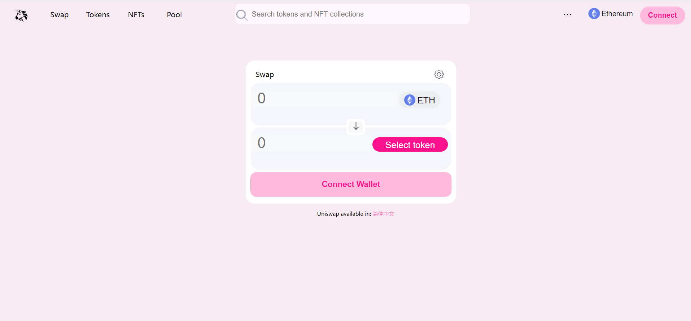
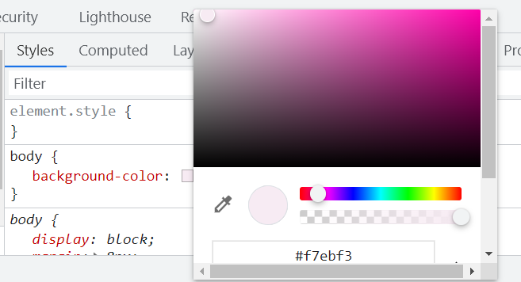
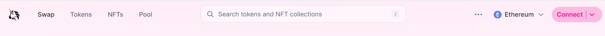
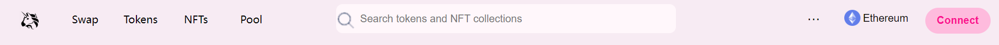
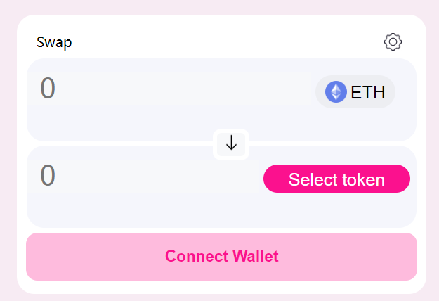

# WTF CSS极简教程: 18. Uniswap页面

WTF CSS教程，总结/搬运自[MDN CSS教程](https://developer.mozilla.org/zh-CN/docs/Learn/CSS)，帮助新人快速入门CSS。

**推特**：[@WTFAcademy_](https://twitter.com/WTFAcademy_)  ｜ [@0xAA_Science](https://twitter.com/0xAA_Science) 

**WTF Academy社群：** [官网 wtf.academy](https://wtf.academy) | [WTF Solidity教程](https://github.com/AmazingAng/WTFSolidity) | [discord](https://discord.wtf.academy) | [微信群申请](https://docs.google.com/forms/d/e/1FAIpQLSe4KGT8Sh6sJ7hedQRuIYirOoZK_85miz3dw7vA1-YjodgJ-A/viewform?usp=sf_link)

所有代码和教程开源在github: [github.com/WTFAcademy/WTF-CSS](https://github.com/WTFAcademy/WTF-CSS)

---

这一讲，我们将在WTF HTML第九讲UniswapHTML的基础上用预处理器less给它增加CSS样式表，最终效果如下：



**注意**：本讲所用的HTML内容在之前的基础上做了略微的调整，想要练习的学员请下载本讲中最新的文件

## background

首先我们设置超链接和背景的样式

`text-decoration: none`可以去除超链接默认的下划线

`body`的`background-color`可以用开发者工具中的取色器取色后直接赋值



```css
// 设置超链接样式
a {
    text-decoration: none;
    color: black;
}

// 改变背景颜色
body {
    background-color: #f7ebf3;
}
```

## `<header>`

然后我们处理头部的样式，Uniswap原生的样式是这样的：



头部的结构很清晰，左边是导航栏，中间是搜索框，右边是菜单

因此使用`flex`来布局是最方便的，同时`justify-content`赋值为`space-between`，两边不需要留空隙

```css
header {
    display: flex;
    justify-content: space-between;
```

接着处理子元素中图片的样式，方便我们观察效果

使用`position`和`top`使图片和文字对齐

```css
    & img {
        width: 30px;
        position: relative;
        top: 10px
    }
```

之后是每个部分的样式，我们一个个看

### `<nav>`

`a`的`display`设置成`inline-block`，这样就可以调整他的宽度。

`line-height`设置成`40px`不仅可以改变`a`的高度，还可以让其中的内容垂直居中。

```css
    & a {
        display: inline-block;
        width: 80px;
        line-height: 40px;
        text-align: center;
```

然后我们要让鼠标悬浮在后面四个`a`上时背景变为灰色，就需要先选择后面四个元素，然后加上`:hover`即可

```css
        &:nth-child(n+2):hover {
            background-color: rgb(212, 212, 212);
            border-radius: 10px;
        }
```

其中n为正整数，也就是0，1，2，3……

`border-radius`不要设置成百分比，因为元素的宽高不同，设置一个固定的值即可。

### `<div class="middle">`

搜索框用`position`调整位置，也就是说`flex`和`position`是可以同时使用的

然后将`border`和`outline`设置为`none`，去除掉未选中和选中时的边框

```css
    .middle {
        width: 520px;
        height: 45px;
        background-color: rgb(255 247 251);
        border-radius: 10px;
        position: relative;
        left: -50px;

        &>input {
            background-color: rgb(255 247 251);
            width: 85%;
            height: 60%;
            border: none;
            outline: none;
            font-size: 16px;
            position: relative;
            top: -5px;
        }
    }
```

### `<div class="right">`

右边菜单的样式没有特别难的地方，需要注意的是鼠标悬浮到`button`上是不会改变形状的，因此我们可以用`cursor: pointer`来提示用户该元素可以被点击

同时还要调整三个子元素的`margin-right`，让它们不要挤在一起。

```css
    &>.right {
        &>.menu {
            font-size: 20px;
            border: none;
            width: 42px;
            height: 40px;
            margin-right: 10px;
            border-radius: 15px;
            background-color: #f7ebf3;

            &:hover {
                background-color: rgb(212, 212, 212);
                cursor: pointer;
            }
        }

        &>.changeNetwork {
            width: 120px;
            height: 40px;
            border: none;
            background-color: #f7ebf3;
            margin-right: 10px;

            &>img {
                position: relative;
                top: 3px;
                width: 25px;
            }

            &>span {
                position: relative;
                top: -3px;
                font-size: 16px;
            }

            &:hover {
                background-color: rgb(212, 212, 212);
                border-radius: 15px;
                cursor: pointer;
            }
        }

        &>.connect {
            background-color: #FEBBDD;
            color: #fb118e;
            border: none;
            width: 100px;
            height: 40px;
            margin-right: 10px;
            border-radius: 20px;
            font-size: 16px;
            font-weight: bold;

            &:hover {
                cursor: pointer;
            }
        }
    }
```

到此`header`里的关键点就讲完了，效果如下：



## `class="body"`

最后我们处理中间内容的样式，这部分会比较复杂。

我们先将`class="body"`的`margin-top`调整为`80px`，将它与头部分开。

然后是`swap-page`的样式，`position`修改为`relative`后，要同时调整`left`和`margin-left`才能让它水平居中(`margin-left`为元素宽度的一般，否则会让它左边居中)

`padding`也需要给它赋值，让`swap-page`与它的子元素分开。

```css
&>.swap-page {
        position: relative;
        background-color: white;
        width: 446px;
        height: 298px;
        left: 50%;
        margin-left: -223px;
        border-radius: 20px;
        padding: 10px;
}
```

接着是`swap-page-header`，`margin`设置为`10px auto`可以让它水平居中。

```css
&>.swap-page-header {
            margin:10px auto;
            width: 422px;
            height: 20px;
}
```

然后是`token1`和`token2`共同的样式，调整它们的`margin`和`padding`可以将它们与父、子元素分离。调整子元素`input`的`padding`可以让输入的内容不紧挨着边框。

```css
        & .token1,
        .token2 {
            background-color: #f5f6fc;
            width: 444px;
            height: 62px;
            margin: 5px auto;
            padding: 16px 0;
            border-radius: 20px;

            &>input {
                background-color: #f7f8fa;
                border: none;
                line-height: 33px;
                font-size: 33px;
                padding: 0 15px;
                outline: none;
            }
```

要注意的是`input1`和`input2`的宽度要根据实际情况设置，因为右边按钮的宽度不一样

```css
            &>.input1 {
                width: 294px;
            }

            &>.input2 {
                width: 235px;
            }
```

之后是`token1-btn`和`token2-btn`不同样式的设计。

```css
            & .token1-btn {
                background-color: #edeef2;
                border: none;
                width: 91px;
                height: 38px;
                border-radius: 19px;
                line-height: 38px;

                & img {
                    position: relative;
                    top: 5px;
                    width: 25px;
                }

                & span {
                    font-size: 20px;
                }

                &:hover {
                    cursor: pointer;
                }
            }
            & .token2-btn {
                background-color: #fb118e;
                color: white;
                border: none;
                width: 167px;
                height: 32px;
                border-radius: 19px;
                line-height: 32px;

                & span {
                    font-size: 20px;
                }

                &:hover {
                    cursor: pointer;
                }
            }
```

接着是两个`input`中间的箭头`button`,将它的`position`设置为`absolute`可以让它从页面中脱离，再调整它的`top`、`left`和`margin-left`让它位于两个`input`中间

```css
        & .arrow {
            background-color: #f7f8fa;
            border: 5px white solid;
            border-radius: 25%;
            position: absolute;
            top: 130px;
            left: 50%;
            margin-left: -10px;

            &>img {
                width: 20px;
            }
        }
```

然后是尾部连接钱包的`button`。

```css
        & .swap-page-footer-connect {
            width: 100%;
            height: 55px;
            border: none;
            border-radius: 13px;
            background-color: #FEBBDD;
            color: #fb118e;
            font-size: 18px;
            font-weight: bold;

            &:hover {
                cursor: pointer;
            }
        }
```

到此swap的样式就完成了，效果如下：



最后就剩下`chooseLanguage`的样式，这部分比较简单。

先将`chooseLanguage`的`display`设置为`inline-block`，方便我们调整它的宽度，宽度设置好之后就可以通过`position`、`left`、`margin-left`和`top`调整它的位置。

```css
    &>.chooseLanguage {
        position: relative;
        display: inline-block;
        width: 172px;
        font-size: 12px;
        left: 50%;
        margin-left: -65px;
        top: 10px;

        &>a {
            color: #fd7bc1;
        }
    }
```

至此，Uniswap极简页面就完成了，效果如下：


可以看到，我们做的极简页面和官方页面是非常相似的。但目前该页面还没有任何功能，这需要我们后续继续给他加上JS。

## 总结

这一讲我们在之前UniswapHTML的基础上增加了样式表，做出的效果与官方页面十分相似。学员们自己练习时不必写的与本教程一模一样，只要能达到预期效果即可。
